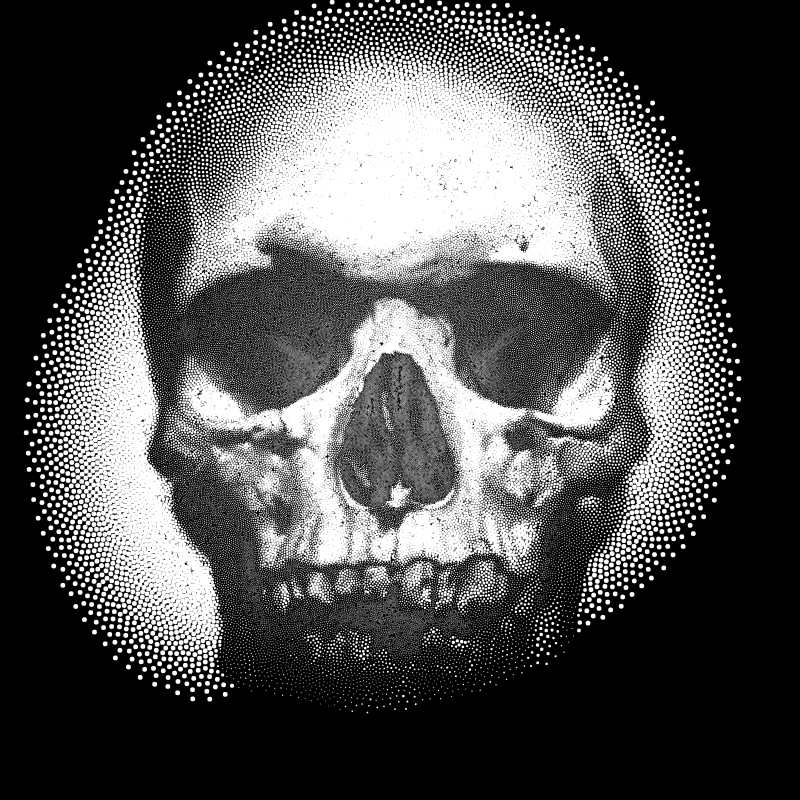

js/canvas knock-off of Robert Hodgin's stippling project   
  [http://roberthodgin.com/stippling/]
  
by way of Jordan Orelli's processing version:   
  [https://github.com/jordanorelli/stippling]

also swiped some vector bits from Processing.js   
  [https://github.com/processing-js/]

Image by James Willamor    
  [https://www.flickr.com/photos/bz3rk/]
under    
  [https://creativecommons.org/licenses/by-sa/2.0/]

Ends up being too slow to run realtime in the browser with decent
fidelity, but does okay at with fewer, larger particles.
